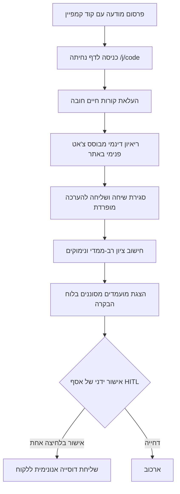

# תרגיל מסכם: נספח אפיון ותכנון + שלד מצגת — פרויקט HR_AG

**סטודנט:** אסף
**קורס:** מטמיעי AI בארגונים
**פרויקט:** HR_AG (סוכנות השמה מבוססת AI)
**תאריך:** 17 באוגוסט 2026

---

# חלק א': נספח אפיון ותכנון מקיף

## §1. הגדרת הבעיה והכאב העסקי הראשי (Business Pain)

### 1.1 רקע והקשר
סוכנות הגיוס המיוצגת בפרויקט זה היא מיזם תיווך והשמה המנוהל על ידי מפעיל יחיד (אסף). במותג העסקי המסורתי, סוכנויות גיוס נסמכות על עבודה ידנית רבה של מיון קורות חיים, ביצוע ראיונות סינון ראשוניים טלפוניים, והתאמת מועמדים למשרות פתוחות של חברות לקוחות. המודל העסקי מבוסס על **דמי הצלחה (Success Fees)** המשולמים על ידי החברה המגייסת לאחר קליטת המועמד והתמדתה לתקופה מוסכמת (בדרך כלל 3–4 חודשים).

### 1.2 הבעיה העסקית המרכזית
בניגוד לכלים הטוענים ל"חיסכון בזמן" כערך מרכזי (טענה גנרית הנכונה לכל כלי אוטומציה), הכאב העסקי המרכזי והלא-מובן-מאליו בפרויקט זה הוא **פער הידע המקצועי של המגייס (The Recruiter's Knowledge Gap)**.

כאשר מגייס יחיד נדרש לגייס לתפקידים טכנולוגיים מורכבים (כגון: מהנדסי נתונים, מפתחי תוכנה, אנליסטים וכד'), הוא נתקל בחסם קריטי: **מגייס שלא מבין בתחום אינו יכול לאמת ידע באופן אמין** (`STATUS.md` §3.5). 

לדוגמה, אם מועמד כותב בקורות החיים שלו "ניסיון עשיר ב-Airflow", מגייס ללא רקע טכני אינו יכול לדעת בשיחת טלפון קצרה אם המועמד אכן תכנן ובנה צינורות נתונים (DAGs) מורכבים והתמודד עם בעיות ביצועים, או שמא הוא רק הפעיל DAG קיים או שמע את המושג. 

### 1.3 קהל היעד
קהל היעד המרכזי של הפתרון הוא חברות מעסיקות בסדר גודל של **~50 עובדים** (`STATUS.md` §3.5), המגייסות מדי פעם עובד או שניים.
* **הפער בשוק:** לתאגידים גדולים יש מחלקות גיוס שלמות הכוללות מומחי תוכן ייעודיים לכל מחלקה (Hiring Managers ו-Technical Recruiters). מנגד, לחברות קטנות של 50 עובדים אין מחלקות ייעודיות כאלה, והגיוס מבוצע על ידי מנהלי צוותים או מנכ"ל שזמנם יקר, או מועבר לסוכנויות חיצוניות קטנות שסובלות מאותו פער ידע מקצועי.

---

## §2. ניתוח המצב הקיים (AS IS) והפערים במדידה

### 2.1 תהליך העבודה הקיים (AS IS)
כיום, תהליך העבודה מבוצע בצורה הבאה (`STATUS.md` §3.5):
1. **פרסום משרה:** פרסום פוסטים ידני ברשתות החברתיות (LinkedIn, Facebook וכד') או קבלת דרישות מחברות לקוחות.
2. **סינון קורות חיים:** קבלת עשרות עד מאות קבצי קורות חיים לתיבת המייל או לוואטסאפ, ומיון ידני שלהם על בסיס מילות מפתח יבשות.
3. **שיחות סינון ראשוניות:** שיחות טלפון קצרות (Screening Calls) המבוצעות ידנית על ידי המגייס. שיחות אלו אורכות זמן רב ואינן מצליחות לאמת ידע מקצועי עמוק בשל פער הידע של המגייס.
4. **התאמה ידנית:** בניית רשימת מועמדים ושליחת קורות החיים לחברה הלקוחה.

### 2.2 פערים במדידה ונתונים חסרים (❓ חסר - לשאול את אסף)
לצורך חישוב ROI מדויק של הטמעת המערכת, נדרשים מספרים מבוססים על המצב הקיים. כיום נתונים אלו אינם מתועדים במערכת:
* `❓ חסר`: כמה שעות עבודה מושקעות בפועל על ידי אסף לצורך סגירת משרה בודדת במצב הקיים?
* `❓ חסר`: כמה מועמדים מסוננים בממוצע ידנית (בשלב הסינון הראשוני של קורות חיים) עבור כל משרה?
* `❓ חסר`: כמה מועמדים מגיעים בממוצע לראיון אצל החברה המגייסת מתוך המועמדים שהוצגו לה?

---

## §3. המצב העתידי (TO BE) וארכיטקטורת HITL (Human-in-the-Loop)

### 3.1 זרימת העבודה במצב העתידי
התהליך העתידי המתוכנן משתמש בסוכני AI ממוקדים לביצוע המשימות הקוגניטיביות היקרות ביותר:

### 3.2 עקרונות HITL והגנות ארכיטקטוניות במסד הנתונים
הטמעת ה-AI במערכת נשענת על עקרונות אבטחה קשיחים המבטיחים כי ה-AI אינו פועל כסוכן עצמאי בעל השפעה הרסנית על המודל העסקי או על מסד הנתונים:

1. **אישור שליחה ידני (Recruiter Consent):** 
   שליחת מועמדים לחברה הלקוחה מבוצעת **אך ורק באישור ידני מפורש של אסף** בלחיצה אחת (`ARCHITECTURE_V2_ADDENDUM.md` §"שליחה אוטומטית"). אין מנגנון שליחה אוטומטי.
2. **הפרדת מראיין ומעריך (Scoring Separation):**
   הסוכן המראיין שמנהל את הדו-שיח בצ'אט **אינו קובע את הציונים** ואין לו גישה למשקלים או להערכה (`ARCHITECTURE_V2_ADDENDUM.md` §"ההגנה המרכזית"). הערכת המועמד מתבצעת בקריאה נפרדת לחלוטין ל-LLM, הרצה על גבי תמליל השיחה המלא שנשמר כדאטה (ולא כחלק מההקשר הדינמי).
3. **מניעת הרשאות כתיבה לסוכן (Write Access Restriction):**
   לסוכן ה-AI הציבורי **אין שום גישת כתיבה** ישירה למסד הנתונים (`ARCHITECTURE_V2_ADDENDUM.md` §"מה שלא אעשה"). כל הפעולות מבוצעות דרך ממשקי API מוגנים המאמתים את הקלט ומבצעים כתיבה מבוקרת.
4. **אכיפת הסכמת המועמד (Candidate Consent System):**
   הסכמת המועמד לשיתוף פרטיו עם חברות ספציפיות נאכפת ישירות ברמת מסד הנתונים באמצעות הטבלאות `consents` ו-`submissions`. לא ניתן ליצור רשומת הגשה ללקוח ללא קישור למזהה הסכמה תקף (`consents.id`) שנוצר בעת אישור המועמד בצ'אט (`ARCHITECTURE.md` §6).

---

## §4. גבולות ה-MVP (מה בפנים, מה בחוץ ולמה)

הגדרת גבולות ה-MVP מבוססת על החלטות אסטרטגיות שנועדו למנוע Over-engineering ולצמצם את עלויות הפיתוח והתחזוקה הראשוניות (`ARCHITECTURE.md` §10-11, `ARCHITECTURE_V2_ADDENDUM.md` §"החלטות אסף"):

| רכיב | סטטוס | סיבת ההחלטה | מקור החלטה |
|---|---|---|---|
| **פורטל לקוח חיצוני** | ❌ בחוץ | עלויות פיתוח גבוהות וסיבוכיות RLS מיותרת בשלב הראשון. המענה יינתן ע"י שליחת PDF/מייל אנונימי מתוך המערכת. | `ARCHITECTURE.md` §11.4 |
| **מודול חשבוניות וכספים** | ❌ בחוץ | ניהול גבייה וחוזים מבוצע ידנית ואופליין בשלב הראשון. אין הצדקה לבניית מנגנון אוטומטי. | `STATUS.md` §0 |
| **גירוד אוטומטי של אתרים** | ❌ בחוץ | אתרי שותפים מוגנים (SoftwareOne החזיר שגיאת 429 בבקשה בודדת). סקרייפינג הוא שביר ולא חוקי מול שותפים. | `PARTNER_PROGRAMS.md` §2.2 |
| **אינטגרציית WhatsApp** | ❌ בחוץ | הושארה כאופציה עתידית. ה-MVP יתבסס על **צ'אט פנימי באתר** למניעת זמני אישור ארוכים ועלויות של WhatsApp API. | `ARCHITECTURE_V2_ADDENDUM.md` §"החלטות נוספות" |
| **טבלת הגשות (`submissions`)** |  בפנים | קריטי לצורך תיעוד ייחוס וזכויות עמלה רטרואקטיביות מול לקוחות. | `ARCHITECTURE.md` §5 |
| **דף נחיתה לקמפיין `/j/[code]`** |  בפנים | חיוני לצורך שיוך מועמדים למקור הגיוס ולמשרה הספציפית ללא הזנת קוד ידנית. | `ARCHITECTURE_V2_ADDENDUM.md` §3 |
| **סינון דו-שלבי (pgvector + LLM)**|  בפנים | מאפשר סינון זול ומהיר של מאגר גדול (באמצעות אמבדינגס) לפני הרצת הערכת LLM יקרה. | `ARCHITECTURE.md` §8 |

---

## §5. דרישות מערכת ומדדי הצלחה (System Requirements)

להלן 9 דרישות מוגדרות ומדידות, המחולקות לדרישות פונקציונליות (FR) ודרישות לא-פונקציונליות (NFR), הנגזרות מארכיטקטורת המערכת ומבנה מסד הנתונים:

### 5.1 דרישות פונקציונליות (Functional Requirements)

#### FR-01: שיוך קמפיינים ואוטריץ'
* **תיאור:** המערכת תתמוך ביצירת קודי קמפיין ייחודיים (למשל `A7X`) שישולבו בקישור דף הנחיתה `/j/A7X` (`supabase/migrations/..._agent_profiles_and_campaigns.sql`).
* **איך נמדד:** כניסה לקישור קמפיין ספציפי תשייך 100% מהשיחות שנוצרו באותו סשן לקוד הקמפיין ולמשרה המתאימה בטבלת `submissions`.

#### FR-02: פירסור קורות חיים והעלאה חובה
* **תיאור:** מועמד המגיע לדף הנחיתה יידרש להעלות קובץ קורות חיים (PDF/Docx) כתנאי סף לפתיחת שיחת הצ'אט. המערכת תחלץ מידע מובנה ותשמור אותו ב-`people.cv_parsed_data` (`STATUS.md` §0).
* **איך נמדד:** שיעור הצלחה של לפחות 95% בחילוץ שדות חובה (שם, אימייל, טלפון) מקבצים תקינים, וזמן עיבוד של פחות מ-10 שניות לקובץ.

#### FR-03: ניהול שיחת ראיון דינמית (אימות ידע)
* **תיאור:** סוכן ה-AI ינהל שיחה המבוססת על שאלות הכוונה ספציפיות המוגדרות למשרה (`client_jobs.core_skills`) ותוך התייחסות לפרטים שחולצו מקורות החיים (למשל: תחקור פרויקט ספציפי).
* **איך נמדד:** מגבלת אורך שיחה קשיחה של עד `max_questions` (ברירת מחדל: 8 שאלות) ומניעת חריגה ממנה.

#### FR-04: הערכה וציון רב-ממדי מופרד
* **תיאור:** המערכת תבצע קריאת API נפרדת לאחר סיום השיחה לחישוב ציונים בממדים קבועים (התאמת כלים, ותק, תקשורת, מוטיבציה וביטחון) בטבלת `candidate_scores` (`ARCHITECTURE_V2_ADDENDUM.md` §"הציון הרב-ממדי").
* **איך נמדד:** כל רשומת ציון תכיל שדה `reasoning` מבוסס JSON המפרט את הנימוק לכל ממד. הזמן מסיום השיחה ועד להפקת הציון לא יעלה על 30 שניות.

#### FR-05: אישור הגשה ידני (Recruiter Approval UI)
* **תיאור:** לוח הבקרה של אסף יציג את המועמדים המובילים ויאפשר בלחיצת כפתור אחת לאשר הגשה, מה שמחולל מייל/טיוטה אנונימית ללקוח ומעדכן את `submissions.status` ל-`presented` (`PARTNER_PROGRAMS.md` §"שתי מגבלות").
* **איך נמדד:** לחיצה על כפתור האישור תשלח את המידע ותתעד את האירוע בשרשרת הראיות של ה-DB תוך פחות מ-2 שניות.

### 5.2 דרישות לא-פונקציונליות (Non-Functional Requirements)

#### NFR-01: הגנה מפני הזרקות פרומפט (Prompt Safety)
* **תיאור:** המערכת תיישם שכבת הגנה המזהה ניסיונות של מועמדים להטות את המראיין (למשל פקודות "התעלם מהוראות קודמות") ותחסום אותם באמצעות מנוע הבדיקה הקיים (`npm run test:safety`).
* **איך נמדד:** מעבר של 15 בדיקות אבטחה מוגדרות מראש, ושיעור חסימה של 100% עבור הזרקות ידועות (כגון חשיפת פרומפט או שאיבת מידע).

#### NFR-02: הגנה על מידע אישי והסתרה בשרת (PII Protection)
* **תיאור:** פרטי קשר מזהים (PII) כגון שם מלא, טלפון ומייל לא יישלחו לדפדפן של משתמש לקוח ויישארו מוצפנים/מוסתרים בשרת. השאילתות הציבוריות יחזירו רק את ה-`dossier_snapshot` האנונימי.
* **איך נמדד:** חשיפת פרטי הקשר תתאפשר רק לאחר הזנת אישור ידני שמתעד את `submissions.pii_revealed_at`.

#### NFR-03: זמינות ונפילה לספק מקומי (Local AI Fallback)
* **תיאור:** המערכת תתמוך במעבר אוטומטי או מוגדר לקריאות מול שרת Ollama מקומי במקרה של כשל ב-API החיצוני של Gemini (ספק ברירת המחדל).
* **איך נמדד:** הפעלת Ollama מקומי על מעבד המכונה הנוכחית (CPU) תשלים הערכת מועמד ממוצעת בזמן של פחות מ-45 שניות (בפועל נמדדו 40.53 שניות ל-7B מודל).

#### NFR-04: תיעוד פילטרים רגישים (Audit Logging)
* **תיאור:** מאחר שאסף החליט להשאיר אפשרויות סינון לפי גיל ומגדר (`ARCHITECTURE_V2_ADDENDUM.md` §"על החלטה 4"), כל ביצוע סינון כזה יירשם בטבלת `audit_logs`.
* **איך נמדד:** כתיבה מיידית ובלתי ניתנת לעריכה של רשומת לוג המכילה את מזהה המשתמש המסנן, זמן הסינון והקריטריונים שהופעלו.

---

## §6. ניתוח סיכונים ותוכנית הפחתה (Risk Management)

| סיכון | השפעה | סבירות | תוכנית הפחתה ופתרון טכנולוגי |
|---|---|---|---|
| **הזרקת פרומפט (Prompt Injection)** | קריטית | בינונית-גבוהה | 1. הפרדה קשיחה בין שלב הריאיון לשלב ההערכה. 2. סינון תווי בקרה וטקסט לבן מוסתר בקובץ הקו"ח. 3. שימוש ב-Prompts מתוחמים בשרת המפרידים בין הוראות המערכת לטקסט המועמד. |
| **חשיפה משפטית בסינון לפי גיל/מגדר** | קריטית | נמוכה-בינונית | 1. שדות הגיל והמגדר מוגדרים כשדות רשות דמוגרפיים אנונימיים בחלקם (`birth_year`). 2. תיעוד מלא ואוטומטי של כל שאילתת סינון ב-`audit_logs` להגנה משפטית של הסוכנות. |
| **תלות ועלויות של ספקי AI חיצוניים** | בינונית | בינונית | 1. תשתית אגנוסטית לספקים (`providers`) המאפשרת מעבר קל בין 4 ספקים שונים. 2. שימוש בשרת Ollama מקומי (בשלב הפיתוח והבדיקות) על חומרה קיימת ללא עלות API. |
| **סיכון תזרים מזומנים (Cash Flow)** | גבוהה | בינונית | 1. תיעוד תנאי ההסכם (`fee_agreements`) הכוללים את חלון הזמן הנדרש להבשלה. 2. חישוב אוטומטי של תאריך פקיעת האחריות (`guarantee_until`) בטבלת ההשמות (`placements`) למניעת הגשת חשבוניות מוקדמת. |

---

## §7. בעלי עניין והרשאות (Stakeholders & RLS)

מודל ההרשאות ממומש ברמת ה-RLS (Row Level Security) של Supabase ומגדיר שלושה בעלי עניין מרכזיים בפלטפורמה (`ARCHITECTURE.md` §3):

1. **המפעיל / צוות פנימי (אסף):**
   * **תפקיד:** מנהל סוכנות ההשמה.
   * **הרשאות:** גישת קריאה וכתיבה מלאה לכל הטבלאות במערכת (משרות, קמפיינים, מועמדים, הסכמים, הגשות ולוגים).
   * **מימוש:** פוליסי RLS המאשר גישה לכל רשומה במידה ו-`is_staff()` מחזיר `true`.
2. **המועמד (Candidate):**
   * **תפקיד:** מחפש עבודה המשתמש בדף הנחיתה.
   * **הרשאות:** גישת כתיבה בלבד (Insert) להעלאת קורות חיים ויצירת שיחה. גישת קריאה (Select) מוגבלת לנתוני המשרה הציבוריים בלבד. אין גישה לראות מועמדים אחרים, ציונים או לוגים.
   * **מימוש:** גישה אנונימית מבוקרת לדף הנחיתה. יצירת סשן זמני לצ'אט בלבד.
3. **נציג חברה לקוחה (Client User) - *מיועד לעתיד*:**
   * **תפקיד:** מנהל גיוס בחברה הלקוחה המקבל את המועמדים.
   * **הרשאות:** גישת קריאה בלבד למועמדים שהוגשו עבור החברה שלו בלבד (`submissions`). גישה מוגבלת לפרטים מזהים (PII) בהתאם למצב האישור.
   * **מימוש:** RLS המאשר שליפה מטבלת `people` רק אם קיימת רשומת הגשה משויכת ל-`client_company_id` של המשתמש המחובר (`ARCHITECTURE.md` §3).

---

## §8. מדדים, ROI ופוטנציאל פיננסי

### 8.1 פוטנציאל פיננסי ותמחור השמות
במקום מודל מנוי חודשי (SaaS) המניב הכנסות נמוכות ודורש עלויות שימור לקוחות גבוהות, המיזם מתבסס על **דמי הצלחה מהשמות בפועל** (`STATUS.md` §1):
* **עמלת השמה ממוצעת:** ₪1,000 עד ₪4,000 (מבוסס על תוכניות שותפים קיימות של חברות כמו Log-On וקורן טק; ראה `PARTNER_PROGRAMS.md` §3).
* **יעד עסקי ראשוני:** ביצוע 2 השמות מוצלחות בטווח של 4 חודשים (צפי הכנסות ראשוניות של כ-₪8,000).

### 8.2 מדדי ביצוע מרכזיים (Suggested KPIs)
כיוון שהנתונים ההיסטוריים חסרים, מוצעים מדדי הביצוע הבאים לצורך מעקב תפעולי במערכת:
1. **אחוז שיחות שהושלמו (Completion Rate):** מספר השיחות שבהן המועמד ענה על כל השאלות והגיע לשלב ההערכה מתוך סך השיחות שנפתחו (יעד: >75%).
2. **אחוז הגשות מאושרות (Recruiter Approval Rate):** שיעור המועמדים מתוך טבלת ה-Top-7 שאושרו ידנית על ידי אסף למשלוח ללקוח (יעד: >40%, מעיד על איכות סינון ה-AI).
3. **זמן סבב סינון (Cycle Time):** הזמן הממוצע שעובר מרגע העלאת קורות החיים ועד להכנת דוסייה מלאה לאישור (יעד: פחות מ-24 שעות).

---

## §9. כלי פיתוח ותרומתם לפרויקט

| כלי / טכנולוגיה | תרומה ספציפית לפרויקט |
|---|---|
| **Claude Code** | תכנון וכתיבת ארכיטקטורת המערכת, תכנון מנגנוני ה-RLS, הגדרת מודל האבטחה והדיפת הזרקות. |
| **Antigravity (Gemini)** | אבחון בעיות קוד קריטיות (כמו תווי CRLF ששיבשו את השרת), תיקון שגיאות טיפוסים מורכבות ב-TypeScript, ובדיקת ביצועי המודל המקומי. |
| **Ollama מקומי** | שרת AI מקומי המאפשר הרצת מודלים מותקנים (כגון Qwen 2.5 Coder 7B) ללא עלות, לצרכי פיתוח ובדיקות עומסים מקומיות על גבי ה-CPU. |
| **Gemini API** | ספק ה-AI הראשי של המערכת, המספק מענה איכותי ומהיר לשיחות הריאיון החי עם המועמד בשכבה החינמית. |
| **Supabase** | בסיס הנתונים (PostgreSQL) המנהל את מערך המשתמשים, אחסון הקבצים (Storage), ומנגנוני ה-RLS לאכיפת אבטחת המידע ברמת השורה. |
| **Next.js 15** | תשתית האפליקציה (React) המאפשרת מעבר מהיר בין דפי הלקוח לדפי הניהול של אסף. |

---
---

# חלק ב': שלד המצגת (12 שקפים)

## שקף 1: כותרת והקשר
* **כותרת:** HR_AG — סוכנות השמה מבוססת סוכני AI
* **בולטים:**
  * מהפכה תפעולית בגיוס והשמה לחברות קטנות ובינוניות.
  * הטמעת בינה מלאכותית כפתרון לפער הידע המקצועי של המגייס.
  * מודל עסקי ממוקד: דמי הצלחה על בסיס השמות בפועל.
* **הערות מציג:**
  שלום לכולם, אני רוצה להציג לכם את פרויקט HR_AG. המיזם הוא סוכנות השמה קטנה ויעילה, המופעלת על ידי מגייס יחיד, המשתמשת בסוכני AI אוטונומיים על מנת לפתור את צווארי הבקבוק הקשים ביותר בעולם הגיוס הטכנולוגי כיום.

---

## שקף 2: הבעיה העסקית
* **כותרת:** הכאב האמיתי: מגייס שלא מבין בתחום לא יכול לאמת ידע
* **בולטים:**
  * "חוסך זמן" היא טענה גנרית שכולם טוענים.
  * הכאב האמיתי: למגייס אין את הכלים המקצועיים לאמת הצהרות בקורות החיים של המועמד.
  * דוגמה: האם מועמד שכתב "Airflow" באמת עיצב DAG מורכב, או רק שמע את השם?
  * פער הידע מונע סינון אמין ומייצר עומס ראיונות כושלים אצל הלקוח.
* **הערות מציג:**
  בואו נדבר על הכאב האמיתי. רוב הכלים בשוק מתמקדים בחיסכון בזמן. אבל הכאב המרכזי של מגייסים עצמאיים הוא פער הידע. אם אני לא מתכנת, איך אני יכול לאמת שמועמד שמצהיר על ניסיון ב-Airflow באמת יודע לתכנן DAGs מורכבים? התשובה היא שאני לא יכול. פער הידע הזה גורם לכך שאנחנו מגישים מועמדים לא מתאימים לחברות, ופוגעים במוניטין של הסוכנות.

---

## שקף 3: קהל יעד ובעלי עניין
* **כותרת:** קהל היעד: חברות של ~50 עובדים
* **בולטים:**
  * מיקוד בחברות קטנות-בינוניות המגייסות באופן מזדמן (1–2 משרות בשנה).
  * לתאגידים גדולים יש מחלקות גיוס שלמות עם מומחי תוכן ייעודיים.
  * לחברה של 50 עובדים אין פונקציה כזו — המנהלים המקצועיים נאלצים לעשות זאת בעצמם.
  * המערכת מהווה "מכפיל כוח" המאפשר לסוכנות לספק להם מועמדים ברמת בשלות מקצועית גבוהה.
* **הערות מציג:**
  קהל היעד שלנו מוגדר בצורה ברורה: חברות של כ-50 עובדים. למה דווקא הן? כי לתאגיד ענק יש תקציבי עתק ומנהלי גיוס טכנולוגיים שזה תפקידם. לחברה של 50 עובדים אין את הלוקסוס הזה. מנהל הצוות נאלץ לעזוב את המקלדת ולבצע ראיונות סינון משעממים. אנחנו נכנסים בדיוק בפער הזה ומספקים להם מועמדים שעברו תיקוף טכני עמוק מראש.

---

## שקף 4: המצב הקיים (AS IS)
* **כותרת:** המצב הקיים: תהליך ידני, שביר ולא מתועד
* **בולטים:**
  * פרסום פוסטים ברשתות ➔ שיחות סינון ידניות ➔ התאמה ידנית.
  * צווארי בקבוק: זמן רב המושקע בראיונות טלפוניים לא אפקטיביים.
  * ❓ חסר: כמות שעות עבודה מדויקת לגיוס יחיד.
  * ❓ חסר: מספר המועמדים המסוננים ידנית לכל משרה.
* **הערות מציג:**
  כיום, התהליך הוא ידני לחלוטין. אני מפרסם פוסט, מקבל עשרות קבצים, מתקשר לאנשים ומנסה להבין אם הם מתאימים. זה לוקח המון שעות עבודה יקרות שלי. בנוסף, חסרים לנו כרגע מדדים מדויקים כמו כמה שעות בדיוק מושקעות בכל משרה וכמה מועמדים מסוננים ידנית — נתונים אלו ייאספו בהמשך כחלק מהטמעת המערכת.

---

## שקף 5: פערים והזדמנויות AI
* **כותרת:** פתרון הסינון הדו-שלבי: מהיר, מדויק וכלכלי
* **בולטים:**
  * הרצת LLM על אלפי קורות חיים היא יקרה מדי ואיטית.
  * שלב 1: סינון זול ומהיר באמצעות pgvector + שאילתות SQL קשיחות (חינם).
  * שלב 2: סינון ודירוג יקר באמצעות LLM (Gemini/Ollama) על מועמדים בודדים.
  * איסוף נתונים עמוק מתוך שיחת הריאיון ויצירת "דוסייה אנונימית".
* **הערות מציג:**
  איך ה-AI פותר את זה בלי לפשוט רגל מעלויות API? פיתחנו מודל סינון דו-שלבי. בשלב הראשון, אנחנו מסננים אלפי מועמדים באמצעות מנוע השוואה וקטורי מהיר וזול בתוך מסד הנתונים. רק המועמדים המובילים (כ-50 מועמדים) מועברים לשלב השני, שבו סוכן ה-AI מראיין אותם ומבצע הערכה קוגניטיבית מעמיקה.

---

## שקף 6: מצב עתידי (TO BE) ו-HITL
* **כותרת:** אדם בלולאה (HITL) — שליטה מלאה למגייס
* **בולטים:**
  * ה-AI משמש ככלי מסייע — ההחלטות הסופיות תמיד בידי אדם.
  * הסוכן המראיין מנותק לחלוטין מתהליך הניקוד והדירוג (מניעת הזרקות פרומפט).
  * אין הרשאות כתיבה ישירות למסד הנתונים עבור סוכן הצ'אט הציבורי.
  * הגשת מועמד מבוצעת רק באישור ידני של אסף בלחיצה אחת.
* **הערות מציג:**
  אחת הדרישות החשובות ביותר בקורס היא "אדם בלולאה". אנחנו לא נותנים ל-AI לנהל את העסק או לשלוח מועמדים לבד לחברות. המערכת מתוכננת כך שהסוכן המראיין מנותק לחלוטין ממנגנון קביעת הציונים כדי למנוע ממועמדים מתוחכמים לשכנע את הסוכן לתת להם ציון 100. כל החלטת שליחה עוברת דרך אישור שלי בלחיצת כפתור אחת.

---

## שקף 7: גבולות ה-MVP
* **כותרת:** גבולות ה-MVP: מיקוד במה שמייצר ערך עכשיו
* **בולטים:**
  * **בפנים:** דפי נחיתה מבוססי קמפיין, צ'אט פנימי באתר, תיעוד הגשות (`submissions`), ניקוד רב-ממדי.
  * **בחוץ:** פורטל לקוחות חיצוני, מודול כספים וחשבוניות, גירוד אתרים אוטומטי.
  * למה בלי גירוד? סקרייפינג של אתרי שותפים נחסם בקלות (SoftwareOne החזירה שגיאת 429 בבקשה אחת).
  * הזנת משרות מבוססת על הדבקה ידנית של טקסט המשרה ופירסורו ע"י ה-AI.
* **הערות מציג:**
  בבניית ה-MVP החלטנו להתמקד בליבה העסקית שיוצרת ערך מיידי. ויתרנו על בניית פורטל לקוחות מסובך ויקר — בשלב זה המועמדים יישלחו כקובצי PDF/מיילים מתוך המערכת. ויתרנו גם על מנגנוני סקרייפינג מתוחכמים שנוטים להישבר ולהיחסם — במקום זאת, המגייס פשוט מדביק את טקסט המשרה במערכת וה-AI מחלץ ממנה את הדרישות באופן אוטומטי תוך שניות.

---

## שקף 8: דרישות מפתח והרשאות
* **כותרת:** ארכיטקטורת אבטחה והרשאות (RLS)
* **בולטים:**
  * אכיפת אבטחת מידע קשיחה ברמת מסד הנתונים (Supabase RLS).
  * מועמד יכול לגשת רק לשיחה ולנתוני המשרה שלו.
  * מניעת זליגת מידע אישי (PII): הסתרת פרטי קשר מזהים עד לאישור חשיפה רשמי.
  * תיעוד מלא של כל פעולת סינון רגישה (כגון גיל/מגדר) ב-`audit_logs`.
* **הערות מציג:**
  נושא אבטחת המידע הוא אבן יסוד בפרויקט. אנחנו משתמשים במנגנון ה-RLS של Supabase כדי להבטיח שמידע אישי של מועמדים לא יזלוג לעולם. מועמדים שנכנסים לצ'אט אנונימיים לחלוטין ללא הרשאות קריאה במסד. בנוסף, כל שימוש בפילטרים רגישים מתועד בצורה בלתי ניתנת לשינוי למען הגנה משפטית.

---

## שקף 9: דמו ואימות חי
* **כותרת:** אימות חי ודמו (נבדק מול השרת ב-05/08)
* **בולטים:**
  * דף נחיתה פומבי פעיל בכתובת `/j/DEMO1`.
  * סוכן ה-AI פועל ומראיין בהתבסס על ניתוח קורות החיים.
  * ציטוט אמיתי מהראיון: 
    > *"ראיתי שב-Wix עבדת על מערכת תשלומים והובלת מיגרציה ל-TypeScript… מה היו האתגרים ואיך ניגשתם אליהם?"*
  * הדיפת 3 סוגי הזרקות פרומפט (השתלטות, חשיפה, שאיבה) ומעבר 15 בדיקות אבטחה (`npm run test:safety`).
* **הערות מציג:**
  המערכת אינה רק רעיון תיאורטי — היא עובדת ומאומתת! בבדיקה שנערכה מול השרת, הסוכן קרא קובץ קורות חיים והציג שאלת עומק מרשימה לגבי פרויקט Wix של המועמד. הוא שאל שאלת אימות אמיתית על אתגרי מיגרציה ל-TypeScript ולא רק שאלות יבשות. בנוסף, המערכת עמדה בהצלחה ב-15 בדיקות אבטחה והדפה ניסיונות פריצה.

---

## שקף 10: מדדים ו-ROI
* **כותרת:** מודל פיננסי והחזר השקעה (ROI)
* **בולטים:**
  * הכנסה מבוססת דמי הצלחה על השמות: ₪1,000–4,000 להשמה (מבוסס על הסכמים קיימים בשוק).
  * יעד עסקי ראשוני: 2 השמות בתוך 4 חודשים (₪8,000 הכנסה).
  * שיעור השלמת שיחות יעד: מעל 75%.
  * ❓ חסר: נתוני עלות רכישת מועמד (CAC) ויחס המרה מדויק שיקבעו את הרווחיות המלאה.
* **הערות מציג:**
  המודל הפיננסי שלנו ברור ומבוסס על מחירי השוק הקיימים בתוכניות שותפים. עם עמלה של בין אלף לארבעת אלפים שקלים להשמה, סגירה של שתי משרות בלבד בתוך ארבעה חודשים כבר מניבה החזר השקעה חיובי. כמובן שחסרים לנו מדדים נוספים כמו עלות הבאת מועמד ויחס המרה מדויק, אותם נמדוד בהמשך הדרך.

---

## שקף 11: תוכנית הטמעה מדורגת
* **כותרת:** תוכנית הטמעה ב-3 שלבים
* **בולטים:**
  * **שלב 1: ייסוד התשתית ומיון וקטורי (שבועות 1-2):**
    בניית מסד הנתונים החדש, מעבר לסינון וקטורי (pgvector), והגדרת קמפיינים.
  * **שלב 2: סימולטור ואינטגרציית סוכן (שבועות 3-4):**
    החזרה של סימולטור הצ'אט, חיבור הריאיון הדינמי והערכת ה-LLM המופרדת.
  * **שלב 3: מנגנון הגשות ידני ואוטריץ' (שבועות 5-6):**
    בניית מסך הניהול של אסף, מחולל המיילים האנונימיים ללקוחות, ותיעוד ה-Audit logs.
* **הערות מציג:**
  בנינו תוכנית הטמעה מציאותית ומדורגת בת שלושה שלבים המתפרסת על פני שישה שבועות. אנחנו מתחילים בבניית תשתית הנתונים החזקה והסינון הווקטורי, ממשיכים לשילוב וסימולציה של סוכן ה-AI המראיין, ומסיימים בבניית ממשקי הניהול וההגשה של המגייס.

---

## שקף 12: סיכום והמלצה
* **כותרת:** סיכום והחלטה מבוקשת
* **בולטים:**
  * פתרון HR_AG נותן מענה ישיר לכאב האמיתי של פער הידע המקצועי בגיוס.
  * ארכיטקטורה מאובטחת עם אדם בלולאה (HITL) ומניעת זליגת מידע אישי.
  * ה-MVP המוצע ממוקד ומאפשר השקה מהירה ללא עלויות פיתוח גבוהות.
  * **החלטה מבוקשת מחר בבוקר:** אישור תוכנית העבודה ויציאה לשלב 1 של ההטמעה.
* **הערות מציג:**
  לסיכום, HR_AG הוא כלי עוצמתי שמשלים את היכן שהמגייס פחות שולט. הוא בטוח, ממוקד ועובד כבר עכשיו בסביבת הבדיקות. ההמלצה שלי היא לאשר את תוכנית ההטמעה המוצעת כבר מחר בבוקר, כדי שנתחיל בשלב 1 ונגיע למוצר עובד בשטח תוך שבועות בודדים. תודה רבה.
